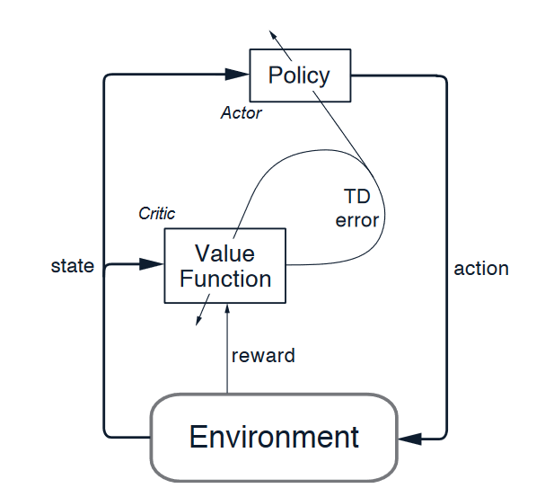

# Snake AI

This repository contains Python 3.9 implementations of the classic Snake game and demonstrations of example algorithms, 
including Hamiltonian cycle, A*, and A3C.

# Installation

Original implementation was written with Python 3.9.13.

Install required packages with pip:

```bash
pip install -r requirements.txt
```

# Algorithms

## Hamiltonian Cycle


Easiest way to win the game is to use Hamiltonian cycle. Hamiltonian cycle is a closed loop that visits each cell 
exactly once, and returns to starting point [1].

Run Hamiltonian cycle example:

```bash
python algorithms\hamiltonian.py 
```

Specify grid size and number of repeats with keyword arguments. For example run 5 repeats on 10x10 grid:

```bash
python algorithms\hamiltonian.py --grid_size 10 --repeats 5 
```

## A*


A* star is a pathfinding algorithm that finds shortest path from source to goal [2]. 

Run A* example:

```bash
python algorithms\a_star.py 
```

Specify grid size and number of repeats with keyword arguments:

```bash
python algorithms\a_star.py --grid_size 10 --repeats 5
```

## Asynchronous Advantage Actor Critic (A3C)


Actor-Critic method combines benefits from value-based and policy-based methods. The Actor (policy function)
proposes a set of possible actions in a given state. The Critic (value function) evaluates actions taken by the Actor
by estimating future rewards [3]. Output of the Critic is a scalar signal that drives the learning for both Actor
and Critic [4].

After each step, Critic evaluates if things have gone better of worse. The evaluation is the TD Error. In 
case the TD Error is positive, tendency for related actions is increased [4]. 



A3C is a deep reinforcement learning algorithm, where multiple agents are executed asynchronously
on multiple instances of the environment [5]. 

### Run demo with pretrained Agent

This repository contains pretrained weights for an Agent trained on 6x6 grid. Run demo with command

```bash
python a3c\play.py --weights_path a3c/model/weights/model.keras
```

### Training Agent

Start training by running train.py. Execution requires positional save_folder argument. 

For example start training and save log and weights to C:\tmp\a3c-training folder.

```bash
python a3c\training\train.py C:\tmp\a3c-training
```

Training will run until max_episodes limit is reached. Default value for limit is 15000. Change value with 
--max_episodes argument.

Continue training for pretrained model by defining --weights_path.

```bash
python a3c\training\train.py C:\tmp\a3c-training --weights_path "path_to_weights"
```

See all available arguments for the training with --help  

```bash
python a3c\training\train.py --help
```

### References

[1] Hamiltonian Cycle [Wolfram MathWorld](https://mathworld.wolfram.com/HamiltonianCycle.html)

[2] A* [wikipedia](https://en.wikipedia.org/wiki/A*_search_algorithm)

[3] Mnih, V. Et al. (2016). Asynchronous Methods for Deep Reinforcement Learning, [arXiv:1602.01783](https://arxiv.org/pdf/1602.01783.pdf)

[4] R. Sutton & A. Barto, (2014-2015), Reinforcement Learning An Introduction, p. 257, [Book PDF](https://web.stanford.edu/class/psych209/Readings/SuttonBartoIPRLBook2ndEd.pdf)

[5] Actor Critic Method [Keras examples](https://keras.io/examples/rl/actor_critic_cartpole/)